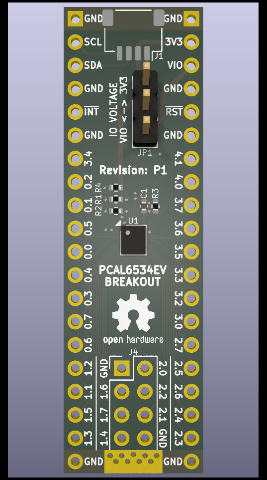
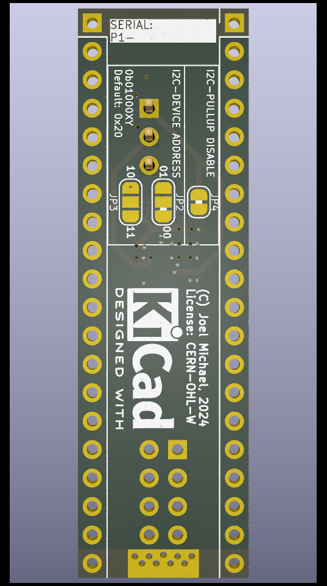

# PCAL6534EV Breakout

## Contents

- [What?](#what)
- [Why?](#why)
- [How?](#how)
- [Can I buy one?](#can-i-buy-one)
- [Can I make one?](#can-i-make-one)
- [Can I make heaps and sell them?](#can-i-make-heaps-and-sell-them)
- [No really, why?](#no-really-why)
- [Board revision history](#board-revision-history)

## What?

This is a breakout board for the [NXP PCAL6534EV I2C GPIO expander](https://www.nxp.com/products/interfaces/ic-spi-i3c-interface-devices/general-purpose-i-o-gpio/ultra-low-voltage-level-translating-34-bit-ic-bus-smbus-i-o-expander:PCAL6534). The board breaks out 32 out of the possible 34 GPIO pins, with 26 of the 32 GPIO pins arranged in a DIP-style layout at 12.7mm column spacing which is perfect for breadboard or protoboard use. There is also a [SparkFun QWIIC-compatible connector](https://www.sparkfun.com/qwiic), for easy connection to other QWIIC-compatible boards.

## Why?

It all started a few years ago, when I was on a holiday in Italy and I found this wonderful little cafe that I stopped at for lunch. I convinced the chef to give me his secret recipe, which he did on one condition: I'm not allowed to tell anybody else until the day I die.

I'm still well and truly alive despite all reports to the contrary, and despite the lack of sleep (#DadLife), so I'm not going to tell you, instead I'm going to make this breakout board instead.

## How?

Please refer to the [PCAL6534EV Datasheet](https://www.nxp.com/docs/en/data-sheet/PCAL6534.pdf) and the [Board Schematic](PCAL6534EV-breakout.pdf) for further details.

- [Connecting](#connecting)
- [Powering](#powering)
- [I2C communication](#i2c-communication)
- [Interrupt and reset](#interrupt-and-reset)
- [GPIO use](#gpio-use)
- [Mounting](#mounting)

### Connecting

Solder the 20-pin headers into each side and slam it into a breadboard! The width is minimised to allow access to 3 pins on each side - wider breakout and prototype boards have always annoyed me by only allowing access to 1 or 2 pins on each side.

Use the QWIIC-compatible connector J1 to connect to your MCU, as the PCAL6534EV is optimised to run at 3.3V. You may run into current supply limits when using the very thin 28AWG wire in QWIIC-compatible cables, as the PCAL6534EV can source up to 450mA or sink up to 500mA of current. If you're driving a lot of LEDs or something, hook up an additional 3.3V power connection to the pin header, and maybe a chonky electrolytic capacitor across 3V3 or VIO.

You can also solder wires directly to the pin headers if needed, or solder the pin headers to a protoboard, or just do what you want I'm not your mum.

At the very bottom edge of the breakout board is an exposed ground plane, designed for you to attach an alligator clip while probing with a multimeter, osciloscope, or logic analyzer.

### Powering

The PCAL6534EV requires 2 power supplies, VDD(i2c) and VDD(p). VDD(i2c) is wired to the 3V3 rail, and must be in the range of 0.8 to 3.6V, allowing you to use lower voltage MCU or FPGA I2C lines. VDD(p) is wired to jumper JP1, and must be in the range of 1.65 to 5.5V. Jumper JP1 selects the source rail of VDD(p), either 3V3 or VIO. When jumper JP1 is set to 3V3, the 3V3 input voltage range is narrowed to 1.65 to 3.6V. When jumper JP1 is set to VIO, the desired IO voltage must be supplied on the VIO pin.

### I2C communication

The PCAL6534EV supports I2C standard-mode at up to 100kHz, fast-mode at up to 400kHz, or fast-mode plus at up to 1000kHz. The breakout board contains 4.7kΩ pull-up resistors from I2C SDA and SCL lines to the 3V3 rail. These pull-up resistors can be disabled by cutting the PCB trace jumper JP4 on the back of the breakout board.

The PCAL6534EV I2C device address is set by connecting the ADDR line to either SDA, SCL, VSS (ground), or VDD(i2c), with a base 7-bit I2C device address of `0b0100000` (`0x20`). The breakout board defaults to the base address `0x20`, and by cutting and bridging PCB jumper pins on JP2 and JP3 can set the device address to `0x20`, `0x21`, `0x22`, or `0x23` according to the following table:

|Jumper|Pins|Address|
|------|----|-------|
|JP2|1-2|0x20|
|JP2|2-3|0x21|
|JP3|1-2|0x22|
|JP3|2-3|0x23|

> ⚠️ SDA and SCL pins **ARE NOT** 5V-tolerant!

### Interrupt and reset

The PCAL6534EV contains both an Interrupt (IRQ) line, and a Reset (RST) line. Both lines are active-low. The IRQ output line uses an open-drain driver, and the breakout board contains a 10kΩ pull-up resistor to VDD(i2c) because most likely you'll be using the IRQ signal on the same MCU that the I2C controller is running on. If you really really really REALLY need to change this, you can remove R4 and connect another pull-up resistor between the R4 pad 1 (closest to JP4) and VIO.

The Reset input line is an active-low input, and the breakout board contains a a 10kΩ pull-up resistor to VDD(i2c) because most likely you'll be supplying the Reset signal from the same MCU that the I2C controller is running on, or you've wired the Reset line to an external momentary switch and you don't care about the voltage. If you're using a momentary switch, add a 0.1µF capacitor in parallel to the switch for a hardware debouncer and noise filter. It is safe to leave the Reset line disconnected from the breakout board.

> ⚠️ Interrupt and Reset pins **ARE NOT** 5V-tolerant!

### GPIO use

It's a... uh... low-speed GPIO? Just use them, the default PCAL6534EV configuration should work for most cases! All the GPIO pins are 5V-tolerant, and will even produce 5V output if you're using 5V on VIO, so feel free to hook them up to your old MEGA328P-based Arduinos and do voltage level translation. You can even drive a LOT of LEDs directly from the GPIO pins - every pin is recommended to source 10mA or sink 25mA of current, with a combined total of 450mA of sourcing current and 500mA of sinking current.

For advanced use-cases, such as enabling internal 100kΩ pull-up or pull-down resistors, switching between push-pull or open-drain output mode, enabling interrupt generation, enabling debouncing filters, or reducing the drive strength to limit GPIO switching noise, please refer to the datasheet.

> ✔️ GPIO pins **ARE** 5V-tolerant!

### Mounting

Due to asthetics and space constraints there isn't enough room for a full-size mounting hole, however in the middle of the OSHW logo there is a 1mm pilot hole that you can use to drill a mounting hole. Ideal? No. Pragmatic? Yes. 

Personally I wouldn't drill a hole larger than 3mm, which will allow you to use a M3 fastener, but you should be able drill up to a 5mm hole without hitting traces. If using metal fasteners, use nylon washers to avoid damage to traces by screw heads.

## Can I buy one?

Sure! Once I've got enough requests for a small batch run I'll send off an order. I test every single board to make sure it's fully functional before shipping.

## Can I make one?

Sure, why not? The board is designed to be manufactured using JLCPCB's 6-layer fabrication constraints as at March 2024 by using budget-size 50mm maximum dimension, budget 0.3mm drill size, 0.8mm thickness, 1oz outer copper, 0.5oz inner copper, and the budget (but surprisingly good) JLC06081H-1080A stackup. It currently does not meet OSHPARK fabrication constraints, as the trace and space minimum of 0.09mm is smaller than the required 0.1mm and there is some via-in-pad use which is currently unsupported.

## Can I make heaps and sell them?

Technically yes, but I'd love it if you gave me a cut in exchange for the testing system that I've developed.

## No really, why?

I wanted to use this GPIO expander in another project, and making a breakout board was probably the best way to verify if my layout hacks would work at all.

Also, shits and giggles: seeing who's both willing and able to manufacture the boards.

## Board Revision History

- [P1](#p1-prototype-1)

### P1: Prototype 1

First prototype, for testing if this even works at all
